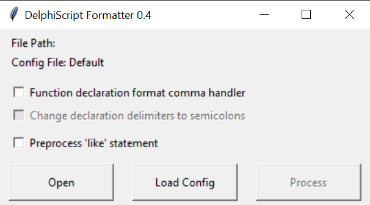

# DelphiScriptFormatter

A Formatter Using [Quadroids Binaries](https://github.com/quadroid/jcf-pascal-format/releases/tag/v1.0.1) that also supports DelphiScript and Code Snippets

Formatting Altium Delphi Script Code is not trivial. The problem is that tools like
[JEDI Code Format](https://jedicodeformat.sourceforge.net/)
and the newer CLI version
[JCF pascal Format](https://github.com/quadroid/jcf-pascal-format)
refuse to format DelphiScript Code because it is "not complete".

Here is a little Python program that:

* Completes your DelphiScript code by inserting "unit Test;" + "interface" + "implementation" at the beginning and "end." at the end
* Formats the Result with Quadroids CLI Formatter
* Removes the formerly added elements from the result and writes the formatted code back
* A backup of your code will be generated (.bak)

Usage:

* Get the latest release from [HERE](https://github.com/dotmjsc/DelphiScriptFormatter/releases/)
* Extract everything to a folder and run "FormatDS.exe"
* Open your DelphiScript file with "Open"
* Optionally load a different Config File (than the pascal-format.cfg in the folder)
* Click on "Process" to Format your file
* Function declaration comma Handling:
  * If this box is checked, it will replace all commas in function and procedure declarations with semicolons so that JCF can handle it
  * If "Change declaration delimiters to semicolons" is set then the declaration delimiters will stay semicolons, else they will be changed back to commas after formatting

Config File:
Optionally, you can load your own Config File. Config files made with the GUI of the old [JEDI Code Format](https://jedicodeformat.sourceforge.net/) are automatically detected and converted.
